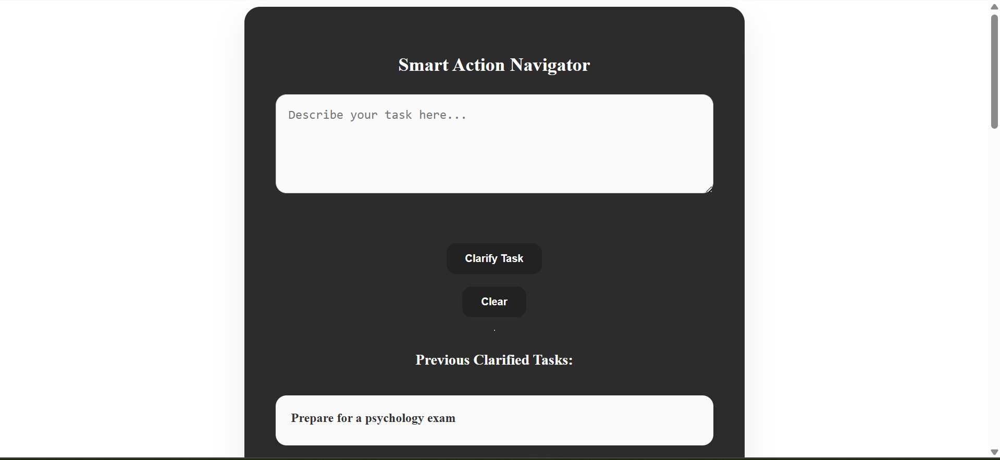
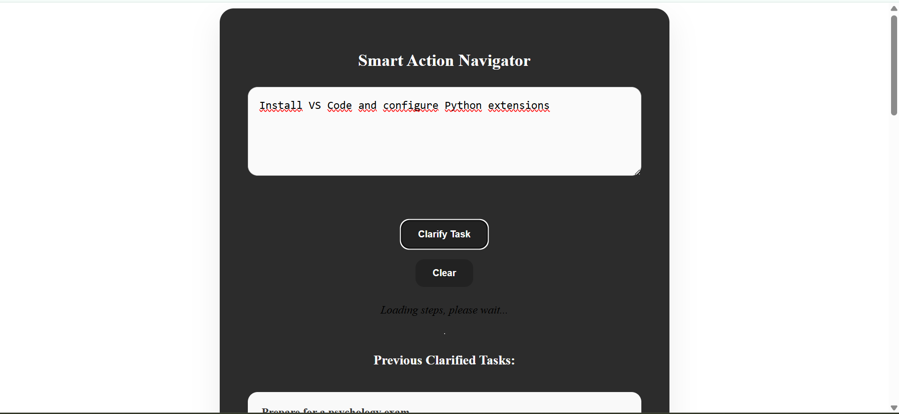
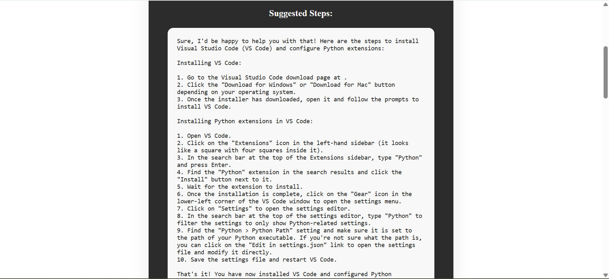

# Smart Action Navigator

Smart Action Navigator is a full-stack web application that allows users to input any task and receive a clear, step-by-step breakdown powered by a large language model (LLM).  
The application stores all previously clarified tasks using PostgreSQL and displays them in an interactive, collapsible card interface.

---

## Features

-  Submit any technical or non-technical task as free text
-  Get detailed multi-step explanations from an LLM (via Together API)
-  Stores all clarified tasks in a PostgreSQL database
-  Expandable/collapsible cards to view past tasks and responses
-  Modern UI built with Angular
-  Organized backend with Flask and SQLAlchemy


---

## Technology Stack

| Layer      | Technology                         |
|------------|-------------------------------------|
| Frontend   | Angular (with standalone components)* |
| Backend    | Flask, Flask-CORS, SQLAlchemy       |
| Database   | PostgreSQL                          |
| AI Model   | Together API (LLM-based model)      |

> *The frontend structure may leverage Angular's standalone component architecture, depending on how modules and services are extended.*

---

## Screenshots

### Homepage – No task entered yet


### Task being submitted – Loading view + existing tasks


### LLM response shown after task submission



## Local Setup

### Backend

```bash
cd backend
python -m venv venv
venv\Scripts\activate  # or source venv/bin/activate
pip install -r requirements.txt
python init_db.py
python app.py

---

## Future Development Ideas

The project is designed to be extended. Potential next steps include:

- **User Authentication**  
  Allow users to register and log in, and store task history per user.

- **Deployment on AWS**  
  - Host backend on AWS EC2 or Lambda  
  - Serve frontend on AWS Amplify or S3  
  - Use Amazon RDS for PostgreSQL persistence  
  - Optionally integrate CloudWatch for logging/monitoring

- **Multi-language support (i18n)**  
  Add support for more languages through Angular's built-in i18n or custom translation service.


